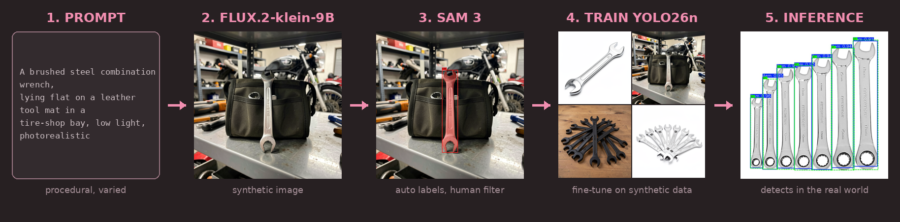

# PromptSmith



Prompt-to-model computer vision, on consumer hardware.

This pipeline uses highly capable models to teach a small and efficient model to solve a
task. FLUX.2-klein-9B generates synthetic training images, SAM 3 labels them, and a
YOLO26n is fine-tuned on the result.

All you need to build a fairly functional specialized object detection model at home is a consumer
GPU from January 2019 (!!!). The only manual step in the training pipeline is to cherry pick the
good images and discard the bad ones.

The target object here is the *wrench*, but the pipeline is generic.

Trained on ~515 synthetic images, the model scores precision 0.92, recall 0.71, mAP@0.5 0.82,
mAP@0.5:0.95 0.64 on a holdout of 137 real photos (hand-taken, hand-labeled, never
seen during training).

Full story and results: http://stefano.petrilli.xyz/prompt-to-model/

## How it works

Each stage is a [go-task](https://taskfile.dev) task (see `tasks/pipeline.yml`), with a
`*-test` variant that runs on a handful of images:

| Task | What it does |
|------|--------------|
| `pipeline:prompts` | Procedurally generate prompts with diverse context, background and lighting (positives + hard-negative confusers), and sample wrench-free negatives from COCO |
| `pipeline:images` | Render the prompts with FLUX.2-klein-9B |
| `pipeline:label` | Detect the objects with SAM 3, emit YOLO labels |
| `pipeline:visualize` | Overlay the boxes on the images for review |
| `pipeline:handpick` | Human approve/discard of the generated images |
| `pipeline:postprocess` | Albumentations degradation, to reduce the gap between artificial and real images |
| `pipeline:train` | Fine-tune YOLO26n on the approved images |
| `pipeline:inference-eval` | Run the trained model on the val split vs ground truth |
| `pipeline:assemble-verification` | Stage + version the real hand-labeled holdout set |
| `pipeline:train-real-val` | Train on synthetic, validate on the real holdout |
| `pipeline:inference-verification` | Run the trained model on the real holdout vs ground truth |

## Quickstart

```bash
task env:setup                        # venv + deps + SAM 3 checkpoint
task pipeline:prompts                 # 1. generate prompts
task pipeline:images                  # 2. generate synthetic images
task pipeline:label                   # 3. SAM 3 labels
task pipeline:visualize               # 4. review overlays
task pipeline:handpick                # 5. approve/discard
task pipeline:postprocess             # 6. degradations
task pipeline:train-real-val          # 7. train, validating on real photos
task pipeline:inference-verification  # 8. evaluate on real photos
```

## Requirements

Python 3.10+, tested on a RTX 2060 with 6 GB VRAM + 16GB of RAM (the 9B transformer spills to RAM and swap,
around 2 min per image), [go-task](https://taskfile.dev) 3.x.

## Layout

- `pipeline/` — one script per stage, runnable directly via `python pipeline/<step>.py`
- `tasks/` — go-task definitions
- `data/` — generated images, labels, assembled YOLO dataset, training runs (gitignored)
- `verification_dataset/` — the real, hand-labeled holdout set (committed, versioned)
